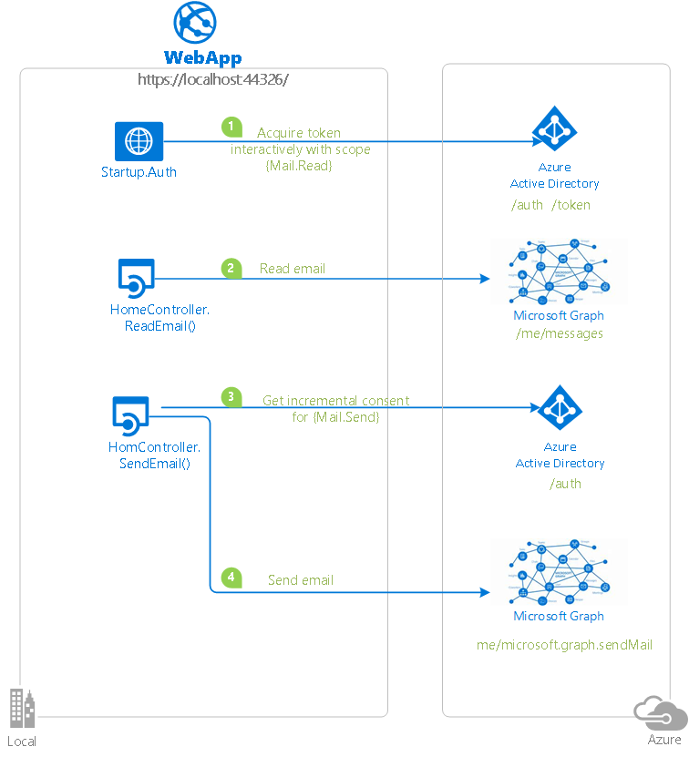
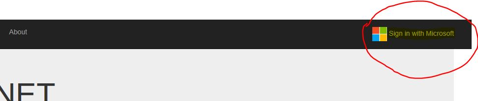
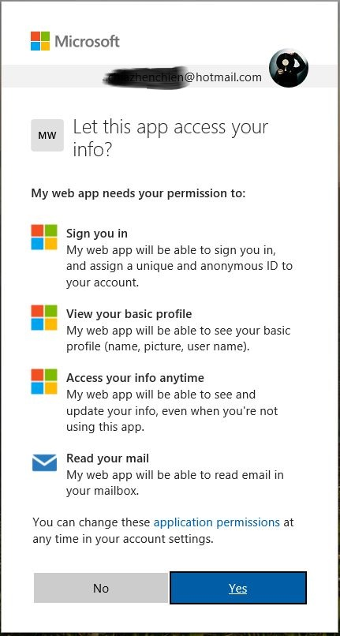
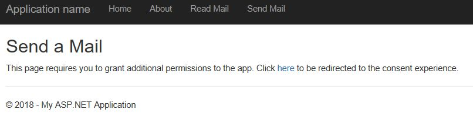
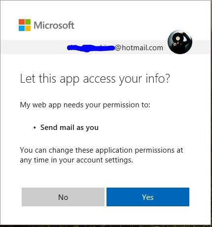

# Integrate Microsoft identity and the Microsoft Graph into a web application using OpenID Connect


## About this sample

### Overview

This sample showcases how to develop a web application that handles sign on via the unified Azure AD and MSA endpoint, so that users can sign in to the app using both their work/school account or Microsoft account. The application is implemented with ASP.NET MVC 4.6, while the web sign-on functionality is implemented via ASP.NET OpenId Connect OWIN middleware.

The sample also shows how to use MSAL.NET (Microsoft Authentication Library) to obtain a token for invoking the [Microsoft Graph](https://graph.microsoft.com). Specifically, the sample shows how to visualize the last email messages received by the signed in user, and how to send a mail message as the user using Microsoft Graph.

Finally, the sample showcases a new capability introduced by the new authentication endpoint - the ability for one app to seek consent for new permissions [incrementally](https://docs.microsoft.com/en-us/azure/active-directory/develop/azure-ad-endpoint-comparison#incremental-and-dynamic-consent).

For more information about how the protocols work in this scenario and other scenarios, see [Authentication Scenarios for Azure AD](http://go.microsoft.com/fwlink/?LinkId=394414).

For more information about Microsoft Graph, please visit the [Microsoft Graph homepage](https://graph.microsoft.io/en-us/).

## Topology



> Looking for previous versions of this code sample? Check out the tags on the [releases](../../releases) GitHub page.

### Scenario

You sign in using your personal Microsoft Account in the app. During this flow, the app asks for consent to read your email only. Then, using this app, you can get the contents of your email's inbox using [Microsoft Graph Api](https://developer.microsoft.com/en-us/graph/docs/api-reference/v1.0/api/user_list_messages).

When you want to send an email, the app then proceeds to ask for an additional permission to send emails on your behalf. Once you provide that, it presents you with a screen using which you can send emails. The emails are sent using [Microsoft Graph API](https://developer.microsoft.com/en-us/graph/docs/api-reference/v1.0/api/message_send).

## How To Run This Sample

To run this sample, you'll need:

- [Visual Studio 2017](https://aka.ms/vsdownload)
- An Internet connection
- At least one of the following accounts:
- A Microsoft Account with access to an outlook.com enabled mailbox
- An Azure AD account with access to an Office 365 mailbox

You can get a Microsoft Account and outlook.com mailbox for free by choosing the Sign-up option while visiting [https://www.microsoft.com/en-us/outlook-com/](https://www.microsoft.com/en-us/outlook-com/).
You can get an Office365 office subscription, which will give you both an Azure AD account and a mailbox, at [https://products.office.com/en-us/try](https://products.office.com/en-us/try).

### Step 1:  Clone or download this repository

From your shell or command line:

```Shell
git clone https://github.com/Azure-Samples/ms-identity-aspnet-webapp-openidconnect.git
```

or download and exact the repository .zip file.

> Given that the name of the sample is pretty long, and so are the name of the referenced NuGet packages, you might want to clone it in a folder close to the root of your hard drive, to avoid file size limitations on Windows.

### Step 2:  Register the sample application with your Azure Active Directory tenant

There is one project in this sample. To register it, you can:

- either follow the steps [Step 2: Register the sample with your Azure Active Directory tenant](#step-2-register-the-sample-with-your-azure-active-directory-tenant) and [Step 3:  Configure the sample to use your Azure AD tenant](#choose-the-azure-ad-tenant-where-you-want-to-create-your-applications)
- or use PowerShell scripts that:
  - **automatically** creates the Azure AD applications and related objects (passwords, permissions, dependencies) for you
  - modify the Visual Studio projects' configuration files.

If you want to use this automation:
1. On Windows run PowerShell and navigate to the root of the cloned directory
1. In PowerShell run:
   ```PowerShell
   Set-ExecutionPolicy -ExecutionPolicy RemoteSigned -Scope Process -Force
   ```
1. Run the script to create your Azure AD application and configure the code of the sample application accordinly. 
   ```PowerShell
   .\AppCreationScripts\Configure.ps1
   ```
   > Other ways of running the scripts are described in [App Creation Scripts](./AppCreationScripts/AppCreationScripts.md)

1. Open the Visual Studio solution and click start

If you don't want to use this automation, follow the steps below

#### Choose the Azure AD tenant where you want to create your applications

As a first step you'll need to:

1. Sign in to the [Azure portal](https://portal.azure.com) using either a work or school account or a personal Microsoft account.
1. If your account is present in more than one Azure AD tenant, select your profile at the top right corner in the menu on top of the page, and then **switch directory**.
   Change your portal session to the desired Azure AD tenant.

#### Register the service app (openidconnect-v2)

1. Navigate to the Microsoft identity platform for developers [App registrations](https://go.microsoft.com/fwlink/?linkid=2083908) page.
1. Select **New registration**.
1. When the **Register an application page** appears, enter your application's registration information:
   - In the **Name** section, enter a meaningful application name that will be displayed to users of the app, for example `openidconnect-v2`.
   - Change **Supported account types** to **Accounts in any organizational directory and personal Microsoft accounts (e.g. Skype, Xbox, Outlook.com)**.
   - In the Redirect URI (optional) section, select **Web** in the combo-box and enter the following redirect URIs: `https://localhost:44326/`.
1. Select **Register** to create the application.
1. On the app **Overview** page, find the **Application (client) ID** value and record it for later. You'll need it to configure the Visual Studio configuration file for this project.
1. From the app's Overview page, select the **Authentication** section.
   - In the **Advanced settings** | **Implicit grant** section, check **ID tokens** as this sample requires
     the [Implicit grant flow](https://docs.microsoft.com/en-us/azure/active-directory/develop/v2-oauth2-implicit-grant-flow) to be enabled to
     sign-in the user, and call an API.
1. Select **Save**.
1. From the **Certificates & secrets** page, in the **Client secrets** section, choose **New client secret**:

   - Type a key description (of instance `app secret`),
   - Select a key duration of either **In 1 year**, **In 2 years**, or **Never Expires**.
   - When you press the **Add** button, the key value will be displayed, copy, and save the value in a safe location.
   - You'll need this key later to configure the project in Visual Studio. This key value will not be displayed again, nor retrievable by any other means,
     so record it as soon as it is visible from the Azure portal.
1. Select the **API permissions** section
   - Click the **Add a permission** button and then,
   - Ensure that the **Microsoft APIs** tab is selected
   - In the *Commonly used Microsoft APIs* section, click on **Microsoft Graph**
   - In the **Delegated permissions** section, ensure that the right permissions are checked: **openid**, **profile**, **offline_access**, **Mail.Read**. Use the search box if necessary.
   - Select the **Add permissions** button
    
1. Select the **Manifest** section for your app.
1. Search for **signInAudience** and make sure it's set to **AzureADandPersonalMicrosoftAccount**

     ```JSON
          "signInUrl": null,
          "signInAudience": "AzureADandPersonalMicrosoftAccount", 
     ```

11. Click **Save** to save the app manifest.

### Step 3:  Configure the Visual Studio project with your app coordinates

1. Open the solution in Visual Studio 2017.
2. Open the `web.config` file.
3. Find the app key `ida:ClientSecret` and replace the value with the application secret you saved from step 2.
4. Find the app key `ida:ClientId` and replace the value with the Application ID from the app registration portal, again in Step 2.
5. If you changed the base URL of the sample, find the app key `ida:RedirectUri` and replace the value with the new base URL of the sample.

### Step 5:  Run the sample

Clean the solution, rebuild the solution, and run it.

Once you run the `MailApp` web application, you are presented with the standard ASP.NET home page.
Click on the **Sign-in with Microsoft** link on top-right to trigger the log-in flow.


On the sign-in page, enter the name and password of a personal Microsoft account or a work/school account. The sample works exactly in the same way regardless of the account type you choose, apart from some visual differences in the authentication and consent experience. During the sign-in process, you will be prompted to grant various permissions - including the ability for the app to read the user's email.



> Remember, the account you choose must have access to an email inbox. If you are using a MSA and the email features don't work, your account might not have been migrated to the new API. The fastest workaround is to create a new test *@outlook.com account. Please refer to the beginning of this readme for instructions.

As you sign in, the app will change the sign-in button into a greeting to the current user - and two new menu commands will appear: `Read Mail` and `Send Mail`.


Click on **Read Mail**: the app will show a dump of the last few messages from the current user's inbox, as they are received from the Microsoft Graph.

Click on **Send Mail**. As it is the first time you do so, you will receive a message informing you that for the app to receive the permissions to send mail as the user, the user needs to grant additional consent. The message offers a link to initiate the process.



Click it, and you will be transported back to the consent experience, this time it lists just one permission, which is **Send mail as you**.



Once you have consented to this permission, you will be transported back to the application: but this time, you will be presented with a simple experience for authoring an email. Use it to compose and send an email to a mailbox you have access to. Send the message and verify you receive it correctly.

Hit the **sign-out** link on the top right corner.

Sign in again with the same user, and follow the exact same steps described so far. You will notice that the send mail experience appears right away and no longer forces you to grant extra consent, as your decision has been recorded in your previous session.

> Did the sample not work for you as expected? Did you encounter issues trying this sample? Then please reach out to us using the [GitHub Issues](../issues) page.

## About the code

Here there's a quick guide to the most interesting authentication-related bits of the sample.

### Sign in

As it is standard practice for ASP.NET MVC apps, the sign-in functionality is implemented with the OpenID Connect OWIN middleware. Here there's a relevant snippet from the middleware initialization:

```CSharp
app.UseOpenIdConnectAuthentication(
    new OpenIdConnectAuthenticationOptions
    {
        // The `Authority` represents the v2.0 endpoint - https://login.microsoftonline.com/common/v2.0
        ClientId = clientId,
        Authority = String.Format(CultureInfo.InvariantCulture, aadInstance, "common", "/v2.0"),
        RedirectUri = redirectUri,
        Scope = "openid  profile offline_access Mail.Read Mail.Send",
        PostLogoutRedirectUri = redirectUri,
        TokenValidationParameters = new TokenValidationParameters
        {
            ValidateIssuer = false,
            // In a real application you would use IssuerValidator for additional checks, like making s
            // IssuerValidator = (issuer, token, tvp) =>
            // {
            // if (MyCustomTenantValidation(issuer))
            // {
            //   return issuer;
            // }
            // else
            // {
            //  throw new SecurityTokenInvalidIssuerException("Invalid issuer");
            // }
            //},
},
```

Important things to notice:

- The Authority points to the new authentication endpoint, which supports both personal and work and school accounts.
- the list of scopes includes both entries that are used for the sign-in function (`openid, email, profile`) and for the token acquisition function (`offline_access` is required to obtain refresh_tokens as well; `Mail.Read` is required for getting access tokens that can be used when requesting to read the user's mail).
- In this sample, the issuer validation is turned off, which means that anybody with an account can access the application. Real life applications would likely be more restrictive, limiting access only to those Azure AD tenants or Microsoft accounts associated to customers of the application itself. In other words, real life applications would likely also have a sign-up function - and the sign-in would enforce that only the users who previously signed up have access. For simplicity, this sample does not include sign up features.

### Initial token acquisition

This sample makes use of OpenId Connect hybrid flow, where at authentication time the app receives both sign in info the [id_token](https://docs.microsoft.com/en-us/azure/active-directory/develop/id-tokens) and artifacts (in this case, an [authorization code](https://docs.microsoft.com/en-us/azure/active-directory/develop/v2-oauth2-auth-code-flow)) that the app can use for obtaining an [access token](https://docs.microsoft.com/en-us/azure/active-directory/develop/access-tokens). That token can be used to access other resources - in this sample, the Microsoft Graph, for the purpose of reading the user's mailbox.

This sample shows how to use MSAL to redeem the authorization code into an access token, which is saved in a cache along with any other useful artifact (such as associated [refresh_tokens](https://docs.microsoft.com/en-us/azure/active-directory/develop/v2-oauth2-auth-code-flow#refresh-the-access-token)) so that it can be used later on in the application (from the controllers' actions).

The redemption takes place in the `AuthorizationCodeReceived` notification of the authorization middleware. Here there's the relevant code:

```CSharp
AuthorizationCodeReceived = async (context) =>
{
            IConfidentialClientApplication cc = MsalAppBuilder.BuildConfidentialClientApplication();
            AuthenticationResult result = await cc.AcquireTokenByAuthorizationCode(new[] { "Mail.Read" }, context.Code).ExecuteAsync();

```

Important things to notice:

- The `IConfidentialClientApplication` is the primitive that MSAL uses to model the Web application. As such, it is initialized with the main application's coordinates.
- The scope requested by `AcquireTokenByAuthorizationCode` is just the one required for invoking the API targeted by the application as part of its essential features. We'll see later that the app allows for extra scopes, but you can ignore those at this point.

The IConfidentialClientApplication is created in a separate function in the `MsalAppBuilder` class 

```Csharp
        public static IConfidentialClientApplication BuildConfidentialClientApplication()
        {
            IConfidentialClientApplication clientapp = ConfidentialClientApplicationBuilder.Create(Globals.ClientId)
                  .WithClientSecret(Globals.ClientSecret)
                  .WithRedirectUri(Globals.RedirectUri)
                  .WithAuthority(new Uri(Globals.Authority))
                  .Build();

            MSALPerUserMemoryTokenCache userTokenCache = new MSALPerUserMemoryTokenCache(clientapp.UserTokenCache);
            return clientapp;
        }
```

Important things to notice:

- The method builds an instance of the IConfidentialClientApplication using the new [builder pattern introduced by MSAL v3.X](https://github.com/AzureAD/microsoft-authentication-library-for-dotnet/wiki/Client-Applications).

- `MSALSessMSALPerUserMemoryTokenCacheionCache` is a sample implementation of a custom MSAL token cache, which saves tokens in a [MemoryCache](https://docs.microsoft.com/en-us/dotnet/framework/performance/caching-in-net-framework-applications) instance shared across the web app. In a real-life application, you would likely want to save tokens in a long lived store instead, so that you don't need to retrieve new ones more often than necessary.

### Using access tokens in the app, handling token expiration

The `ReadMail` action in the `HomeController` class demonstrates how to take advantage of MSAL for getting access to protected API easily and securely. It also introduces you to the recommended [token acquisition pattern](https://github.com/AzureAD/microsoft-authentication-library-for-dotnet/wiki/AcquireTokenSilentAsync-using-a-cached-token) where you should first attempt to seek an access token in the cache.

Here is the relevant code:

```CSharp
        IConfidentialClientApplication app = MsalAppBuilder.BuildConfidentialClientApplication();
        AuthenticationResult result = null;
        var accounts = await app.GetAccountsAsync();
        string[] scopes = { "Mail.Read" };

        try
        {
            // try to get token silently
            result = await app.AcquireTokenSilent(scopes, accounts.FirstOrDefault()).ExecuteAsync().ConfigureAwait(false);
        }
        catch (MsalUiRequiredException ex)
        {
            // A MsalUiRequiredException happened on AcquireTokenSilentAsync.
            // This indicates you need to call AcquireTokenAsync to acquire a token
            Debug.WriteLine($"MsalUiRequiredException: {ex.Message}");

            try
            {
                // Build the auth code request Uri
                string authReqUrl = await OAuth2RequestManager.GenerateAuthorizationRequestUrl(scopes, app, HttpContext, Url);
                ViewBag.AuthorizationRequest = authReqUrl;
                ViewBag.Relogin = "true";
            }
            catch (MsalException msalex)
            {
                Response.Write($"Error Acquiring Token:{System.Environment.NewLine}{msalex}");
            }
        }
        catch (Exception ex)
        {
            Response.Write($"Error Acquiring Token Silently:{System.Environment.NewLine}{ex}");
        }
```

The idea is simple. The code creates a new instance of `IConfidentialClientApplication` with the exact same coordinates as the ones used when redeeming the authorization code at authentication time. In particular, note that the exact same cache is used.
That done, all you need to do is to invoke `AcquireTokenSilent`, asking for the scopes you need. MSAL will look up the cache and return any cached token, which matches with the requirement. If such access tokens are expired or no suitable access tokens are present, but there is an associated refresh token, MSAL will automatically use that to get a new access token and return it transparently.

In the case in which refresh tokens are not present or they fail to obtain a new access token, MSAL will throw `MsalUiRequiredException`. That means that in order to obtain the requested token, the user must go through an interactive experience.

In the case of this sample, the `Mail.Read` permission is obtained as part of the login process - hence we need to trigger a new login; however we can't just redirect the user without warning, as it might be disorienting (what is happening, or why, would not be obvious to the user) and there might still be things they can do with the app that do not entail accessing mail. For that reason, the sample simply signals to the view to show a warning - and to offer a link to an action (`RefreshSession`) that the user can leverage for explicitly initiating the reauthentication process.

### Handling incremental consent and OAuth2 code redemption

The `SendMail` action demonstrates how to perform operations that require incremental consent.
Observe the structure of the GET overload of that action. The code follows the same structure as the one you saw in `ReadMail`: the difference is in how `MsalUiRequiredException` is handled.
The application did not ask for `Mail.Send` during sign-in, hence the failure to obtain a token silently could have been caused by the fact that the user did not yet grant consent for the app to use this permission. Instead of triggering a new sign-in as we have done in `ReadMail`, here we can craft a specific authorization request for this permission. The call to the utility function `GenerateAuthorizationRequestUrl` does precisely that, leveraging MSAL to generate an OAuth2/OpenId Connect request for an authorization code for the Mail.Send permission.
That request, which is in fact a URL, is injected in the view as a hyperlink: once again, the user sees that link as part of a warning that the current operation requires leaving the app and going back to the authentication and consent pages.
When the user clicks that link, they are brought through the authorization flow that eventually leads to the app receiving an authorization code that can be redeemed for an access token containing the scope requested. However, the standard collection of OWIN middleware doesn't include anything that can be used for redeeming an authorization code for access and refresh tokens outside of a sign-in flow.
This sample works around that limitation by providing a simple custom middleware, **which takes care of intercepting messages containing authorization codes, validating them, redeeming the code and saving the resulting tokens in an MSAL cache, and finally redirecting to the URL that originated the request.**

Back in Startup.Auth.cs, you can see the custom middleware initialization logic right between the cookie middleware and the OpenId Connect middleware. **The position in the pipeline is important**, as in order to save the tokens in the correct cache the custom middleware needs to know who the current user is.

```CSharp
    app.UseCookieAuthentication(new CookieAuthenticationOptions());

    app.UseOAuth2CodeRedeemer(
        new OAuth2CodeRedeemerOptions
        {
            ClientId = Globals.ClientId,
            ClientSecret = Globals.ClientSecret,
            RedirectUri = Globals.RedirectUri
        }
        );

app.UseOpenIdConnectAuthentication(

```

Note that the custom middleware is provided only as an example, and it has numerous limitations (like a hard dependency on `MSALPerUserMemoryTokenCache`) that limit its applicability outside of this scenario.

## Community Help and Support

Use [Stack Overflow](http://stackoverflow.com/questions/tagged/msal) to get support from the community.
Ask your questions on Stack Overflow first and browse existing issues to see if someone has asked your question before.
Make sure that your questions or comments are tagged with [`msal` `dotnet` `microsoft-graph`].

If you find a bug in the sample, please raise the issue on [GitHub Issues](../../issues).

To provide a recommendation, visit the following [User Voice page](https://feedback.azure.com/forums/169401-azure-active-directory).

## Contributing

If you'd like to contribute to this sample, see [CONTRIBUTING.MD](/CONTRIBUTING.md).

This project has adopted the [Microsoft Open Source Code of Conduct](https://opensource.microsoft.com/codeofconduct/). For more information, see the [Code of Conduct FAQ](https://opensource.microsoft.com/codeofconduct/faq/) or contact [opencode@microsoft.com](mailto:opencode@microsoft.com) with any additional questions or comments.

## More information

For more information, visit the following links:

- [Add sign-in with Microsoft to an ASP.NET web app (V2 endpoint)](https://docs.microsoft.com/en-us/azure/active-directory/develop/guidedsetups/active-directory-aspnetwebapp) explains how to re-create the sign-in part of this sample from scratch.
- To learn more about the code, visit [Conceptual documentation for MSAL.NET](https://github.com/AzureAD/microsoft-authentication-library-for-dotnet/wiki#conceptual-documentation) and in particular:

  - [Acquiring tokens with authorization codes on web apps](https://github.com/AzureAD/microsoft-authentication-library-for-dotnet/wiki/Acquiring-tokens-with-authorization-codes-on-web-apps)
  - [Customizing Token cache serialization](https://github.com/AzureAD/microsoft-authentication-library-for-dotnet/wiki/token-cache-serialization)
  - [Acquiring a token on behalf of a user Service to Services calls](https://github.com/AzureAD/microsoft-authentication-library-for-dotnet/wiki/on-behalf-of) 

- Articles about the Azure AD V2 endpoint [http://aka.ms/aaddevv2](http://aka.ms/aaddevv2), with a focus on:

  - [Azure Active Directory v2.0 and OAuth 2.0 On-Behalf-Of flow](https://docs.microsoft.com/en-us/azure/active-directory/develop/active-directory-v2-protocols-oauth-on-behalf-of)
  - [Incremental and dynamic consent](https://docs.microsoft.com/en-us/azure/active-directory/develop/active-directory-v2-compare#incremental-and-dynamic-consent)

- Articles about the Microsoft Graph
  - [Overview of Microsoft Graph](https://developer.microsoft.com/en-us/graph/docs/concepts/overview)
  - [Get access tokens to call Microsoft Graph](https://developer.microsoft.com/en-us/graph/docs/concepts/auth_overview)
  - [Use the Microsoft Graph API](https://developer.microsoft.com/en-us/graph/docs/concepts/use_the_api)
